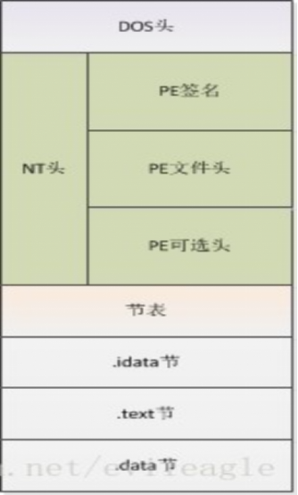
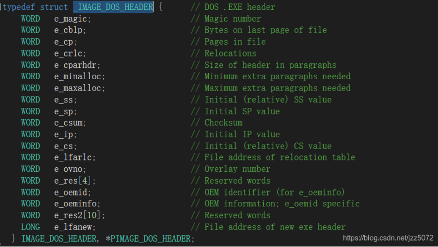
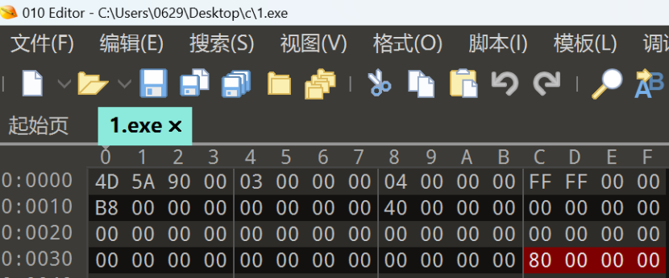
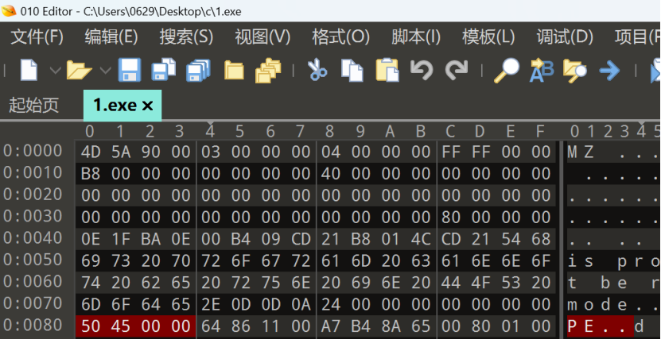
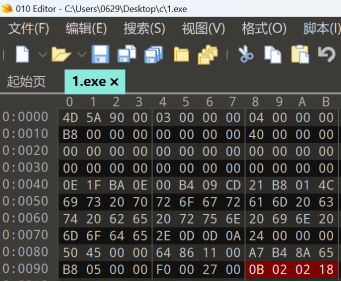
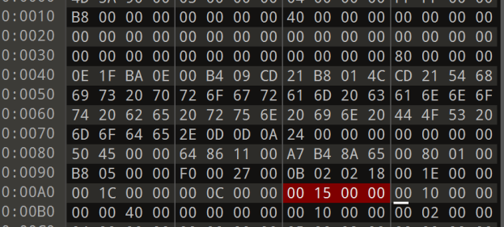

PE文件结构

1.MS-DOS头
出于兼容性目的而存在，防止pe在dos文件里运行

第一个字段：判断是不是一个可执行文件
最后一个字段（PE头偏移）：e_Ifanew(0x3c后4位 指向新的PE头，用来表示DOS头之后的NT头相对文件起始地址的偏移。

如上图，对映地址为00，00，00，80(倒着写
如下图，找到了NT头的Signature

2.NT头
NT头包含windows PE文件的主要信息
其中包括一个‘PE’字样的签名，PE文件头（IMAGE_FILE_HEADER）和PE可选头（IMAGE_OPTIONAL_HEADER32）
typedef struct _IMAGE_NT_HEADERS {
    DWORD Signature;                       0x00
    IMAGE_FILE_HEADER FileHeader;          0x04
    IMAGE_OPTIONAL_HEADER32 OptionalHeader;0x18
} IMAGE_NT_HEADERS32, *PIMAGE_NT_HEADERS32;
其中IMAGE_FILE_HEADER FileHeader是PE文件头
typedef struct _IMAGE_FILE_HEADER {
    WORD    Machine;
    WORD    NumberOfSections;
    DWORD   TimeDateStamp;
    DWORD   PointerToSymbolTable;
    DWORD   NumberOfSymbols;
    WORD    SizeOfOptionalHeader;
    WORD    Characteristics;
} IMAGE_FILE_HEADER, *PIMAGE_FILE_HEADER;

NumberOfSections：该PE文件中有多少个节，也就是节表中的项数。
TimeDateStamp：PE文件的创建时间，一般有连接器填写。
PointerToSymbolTable：COFF文件符号表在文件中的偏移。
NumberOfSymbols：符号表的数量。
SizeOfOptionalHeader：紧随其后的可选头的大小。
其中IMAGE_OPTIONAL_HEADER32 OptionalHeader是PE可选头：
typedef struct _IMAGE_OPTIONAL_HEADER {
    WORD    Magic;
    BYTE    MajorLinkerVersion;
    BYTE    MinorLinkerVersion;
    DWORD   SizeOfCode;
    DWORD   SizeOfInitializedData;
    DWORD   SizeOfUninitializedData;
    DWORD   AddressOfEntryPoint;
    DWORD   BaseOfCode;
    DWORD   BaseOfData;
    DWORD   ImageBase;
    DWORD   SectionAlignment;
    DWORD   FileAlignment;
    WORD    MajorOperatingSystemVersion;
    WORD    MinorOperatingSystemVersion;
    WORD    MajorImageVersion;
    WORD    MinorImageVersion;
    WORD    MajorSubsystemVersion;
    WORD    MinorSubsystemVersion;
    DWORD   Win32VersionValue;
    DWORD   SizeOfImage;
    DWORD   SizeOfHeaders;
    DWORD   CheckSum;
    WORD    Subsystem;
    WORD    DllCharacteristics;
    DWORD   SizeOfStackReserve;
    DWORD   SizeOfStackCommit;
    DWORD   SizeOfHeapReserve;
    DWORD   SizeOfHeapCommit;
    DWORD   LoaderFlags;
    DWORD   NumberOfRvaAndSizes;
    IMAGE_DATA_DIRECTORY DataDirectory[IMAGE_NUMBEROF_DIRECTORY_ENTRIES];
} IMAGE_OPTIONAL_HEADER32, *PIMAGE_OPTIONAL_HEADER32;

DWORD   AddressOfEntryPoint;是程序入口点OEP相对于PE可选头的地址（0x10
DWORD   BaseOfCode;是代码的基地址（存储一堆代码的基地址
DWORD   BaseOfData;是数据的基地址（存储一堆数据的基地址
DWORD：4字节                         WORD：2字节
接下来我们找一下：先从NT头找PE可选头（0x18

接下来直接偏移0x10找入口点OEP

上面看到入口点00,00,15,00后面紧跟着代码基地址00,00,10,00
数据基地址00,40,00,00

3.数据目录
4.节表：是PE文件后续节的描述，windows根据节表的描述加载每个节